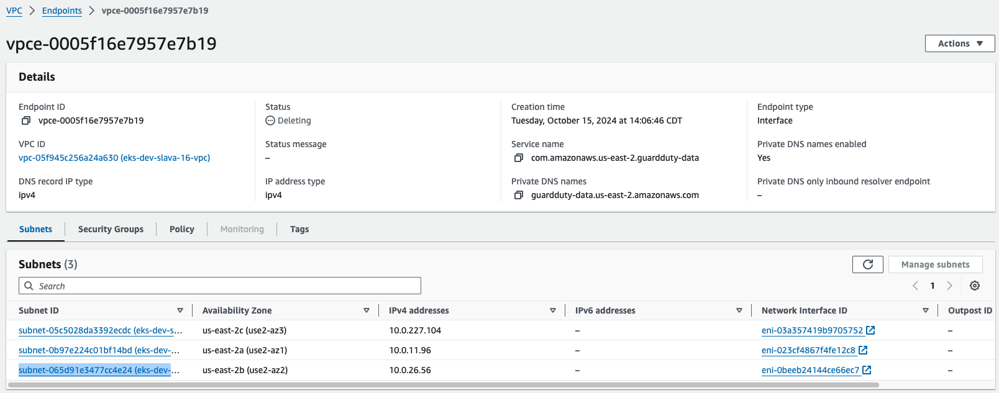

# Manual removal of VPCs

So far a bug is observed in CAPA (Cluster API Provider AWS) with VPC removal: [kubernetes-sigs/cluster-api-provider-aws#5150](https://github.com/kubernetes-sigs/cluster-api-provider-aws/issues/5150)

In order to properly clean up all allocated resources, we need to remove VPCs manually.

The sign of “stuck” VPC looks like a hidden “Delete” button.

Opening “Network Interfaces” and attempting to detach an interface shows disable “Detach” button:

It is required to get to VPC endpoints screen and remove the end-point: 

While the VPC endpoint is being removed it is required to get to the “Network Interfaces” screen and delete all attached network interfaces.

Now, subnets can be removed:

When subnets are removed, all network interfaces disappear.

Now VPC can be finally removed:

## Delete EKS resources with CloudFormation

EKS has a troubleshooting article of cluster removal: https://docs.aws.amazon.com/eks/latest/userguide/delete-cluster.html

It may be used as an alternative way of removal of EKS clusters.
